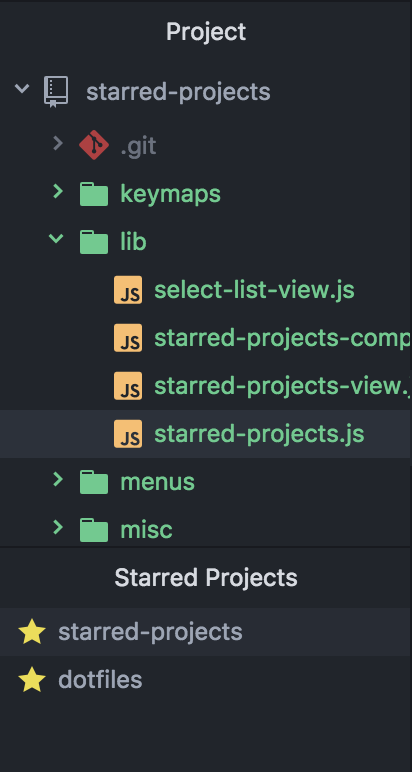
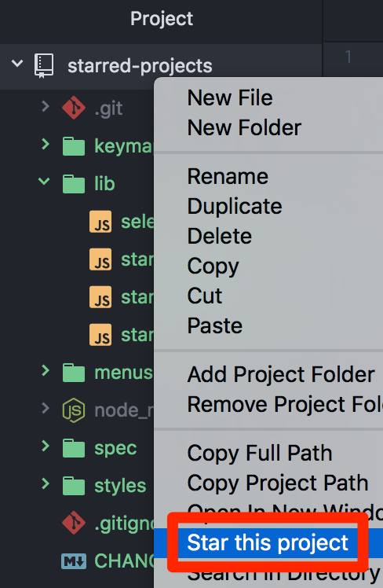

# starred-projects package

**NOTICE: This package is highly exprimental because of using dock system and a little hacking tree-view.**

## Features

### :star: View and open starred projects in the dock.

**NOTE:** Since current atom version (v1.17.x) doesn't provide the ways to handle the layout of docks flexibly, we need to drag the dock or use pane commands (e.g. `pane:split-down-and-move-active-item`) in order to place it at our favorite position.

### :star: Star a project on the context menu of tree view.

### :star: Commands

* `starred-projects:toggle`: Show or hide the dock.
* `starred-projects:open`: Open a starred project.
* `starred-projects:unstar`: Unstar a project.

**NOTE:** `starred-projects:star` is currently an internal command. It will be displayed in the command palette but not work at all.
